# Dry Run

### The batteries-included simulation harness for LangGraph agents — local-first, CI-gated, regression-tested forever.

---

## The Problem

Agents are processes, not functions. They maintain state, call tools, make routing decisions, and interact across multiple turns. A single input-output assertion cannot validate a process — it must be simulated.

Unit tests validate individual tools. Evals validate individual model calls. Neither validates the agent's behavior across multi-turn interactions at the system level. Dry Run is the missing third layer.

## What Dry Run Does

1. **First-run failure surface** — on the very first run, against a generated scenario suite, surfaces where the agent breaks against the scenario rubric. No prior baseline required.
2. **Coverage** — runs the agent against hundreds of scenarios you would never write by hand. Surfaces failures you didn't know existed.
3. **Regression detection** — after every change, diffs the new run against the last known-good run. Gates the deploy.

```
Dry Run — scenario suite results
─────────────────────────────────────────────────
Scenarios:     142 total  |  128 passed  |  14 failed
Aggregate:     0.73  (was 0.81, Δ -0.08)  ← REGRESSION DETECTED

Per-dimension breakdown:
  tool_correctness        0.91  ✓
  argument_correctness    0.88  ✓
  step_efficiency         0.71  ✓
  constraint_adherence    0.95  ✓
  goal_achievement        0.79  ✓
  trajectory_efficiency   0.64  ✗  (threshold: 0.70)
  persona_fit             0.69  ✗  (threshold: 0.70)

Newly failing (3):
  ✗ mid_task_change         trajectory_efficiency: 0.41
  ✗ ambiguous_refund        goal_achievement: 0.38
  ✗ third_escalation        tool_correctness: 0.50

Similar past failures (from Qdrant):
  mid_task_change → similar to:
    • cart_swap_indecisive (similarity 0.89) — same root cause
    • size_change_after_review (similarity 0.81)

EXIT CODE: 1 — regression detected. Deploy blocked.
```

---

## Architecture

Dry Run follows a **hexagonal (ports-and-adapters) architecture** with a strict inward dependency rule. The domain core has zero external dependencies. Infrastructure is pluggable via port interfaces.

```mermaid
graph TB
    subgraph Inbound Adapters
        CLI["CLI (Click)"]
        CI["CI Gate (GitHub Actions)"]
    end

    subgraph Application Layer
        RS["RunSuiteUseCase"]
        GEN["GenerateUseCase"]
        CAP["CaptureUseCase"]
        SIM["SimilarLookupUseCase"]
        SU["SyntheticUser"]
    end

    subgraph Domain Core
        subgraph Models
            SCN["Scenario / Persona"]
            TRC["Trace / AgentTurn"]
            EVL["EvalResult / RunResult"]
        end
        subgraph Ports
            AP["AgentPort"]
            SP["StorePort"]
            LP["LLMPort"]
            EP["EmbeddingPort"]
            GP["GeneratorPort"]
            RP["ReporterPort"]
        end
        subgraph Services
            SCR["Scoring (4 deterministic)"]
            DIF["Diffing"]
            AGG["Aggregation"]
        end
    end

    subgraph Outbound Adapters
        LG["LangGraphAdapter"]
        QD["QdrantStore"]
        OAI["OpenAI LLM Client"]
        EMB["OpenAI Embeddings"]
        DE["DeepEval Judge"]
        DSP["DSPy Generator"]
        TR["Terminal Reporter"]
        PR["PR Comment Reporter"]
    end

    CLI --> RS
    CLI --> GEN
    CLI --> CAP
    CLI --> SIM
    CI --> RS

    RS --> SU
    RS --> SCR
    RS --> DIF
    RS --> AGG

    SU -.->|uses| LP
    RS -.->|uses| AP
    RS -.->|uses| SP
    RS -.->|uses| LP
    RS -.->|uses| RP
    GEN -.->|uses| GP
    CAP -.->|uses| LP
    SIM -.->|uses| SP

    LG -->|implements| AP
    QD -->|implements| SP
    OAI -->|implements| LP
    EMB -->|implements| EP
    DSP -->|implements| GP
    TR -->|implements| RP
    PR -->|implements| RP
    DE -->|wraps| LP

    style SCR fill:#2d5016,stroke:#4a8c2a,color:#fff
    style DIF fill:#2d5016,stroke:#4a8c2a,color:#fff
    style AGG fill:#2d5016,stroke:#4a8c2a,color:#fff
    style AP fill:#1a3a5c,stroke:#2980b9,color:#fff
    style SP fill:#1a3a5c,stroke:#2980b9,color:#fff
    style LP fill:#1a3a5c,stroke:#2980b9,color:#fff
    style EP fill:#1a3a5c,stroke:#2980b9,color:#fff
    style GP fill:#1a3a5c,stroke:#2980b9,color:#fff
    style RP fill:#1a3a5c,stroke:#2980b9,color:#fff
```



**Dependency rule:** Domain depends on nothing. Application depends only on domain. Adapters depend on both — but never on each other. Dependencies always point inward.

---

## Design Decisions

### 1. τ²-bench Information Asymmetry

The synthetic user sees **only the agent's visible output** — never internal reasoning, tool calls, or scratchpads. This is enforced at two levels:

- **Data model:** `AgentTurn.visible_output_text` is a separate field from `output_text`. The adapter is responsible for filtering.
- **Call site:** The runner passes only `visible_output_text` to the synthetic user, not the full output.

Without this constraint, the synthetic user becomes more compliant than a real user, and tests pass trivially. This principle comes directly from the [τ²-bench](https://arxiv.org/abs/2406.12045) information-asymmetry finding.

### 2. Orthogonal LLM-Judge Rubrics

Three LLM-as-judge dimensions, designed to be **genuinely orthogonal** — each measures something the other two cannot:

| Dimension | Judges | Independent of |
|---|---|---|
| **Goal Achievement** | Outcome only — was the user's goal met? | Path efficiency, communication style |
| **Trajectory Efficiency** | Path cost only — how much waste in the tool-call sequence? | Whether the goal was reached, style |
| **Persona Fit** | Style only — was the tone/level appropriate to the persona? | Outcome, path |

The original rubrics (Task Completion / Plan Adherence / Plan Quality) produced correlated scores on the same trace. These three are designed so a high score on one tells you nothing about the others.

### 3. AgentAdapter ABC — Framework Portability

The `AgentPort` interface has three methods: `new_session()`, `step()`, `get_state()`. v1 ships a `LangGraphAdapter`. v1.1 adds CrewAI and AutoGen — each is a single new file in `adapters/outbound/`, zero changes to domain or application.

This isn't speculative extensibility — it's a one-file cost that eliminates the LangGraph-version-churn risk.

### 4. Deterministic + LLM-Judge Split (4 + 3)

Four of seven evaluation dimensions are **deterministic** — no LLM cost, identical results on identical traces across runs:

- Tool correctness (set intersection)
- Argument correctness (structural + optional semantic check)
- Step efficiency (graph-path analysis: loop, thrash, redundancy detection)
- Constraint adherence (counting: turns, tokens, time)

The remaining three use LLM-as-judge via DeepEval's `GEval`. This split means 57% of the evaluation is free, fast, and reproducible.

### 5. Semantic Failure Lookup (UC-5) — Why Qdrant

Qdrant isn't here because "vector DB is cool." It earns its place through one specific use case: when a scenario fails in CI, Dry Run surfaces the **top-3 most semantically similar past failures** from the scenario store. This tells the developer whether this is a known pattern or a new one — before they start debugging.

Scenarios and failure reasons are embedded with `text-embedding-3-small`. The lookup is wired into the reporter output and available as an ad-hoc CLI command (`dryrun similar --to "description"`).

### 6. Goal-Hiding and Persona-Drift Check

The synthetic user's persona prompt includes a **goal-reveal strategy** (`incremental`, `upfront`, `evasive`) that controls how information is disclosed across turns — the way a real user would. Without this, the simulator dumps the full goal in turn 1 and the agent's job becomes trivial.

A **persona-drift self-check** runs once per generated message. One retry on failure, then accept with a warning. This prevents the "as an AI, I can't..." break-character failure mode in long conversations.

---

## Tech Stack

| Technology | Purpose | Why This Choice |
|---|---|---|
| **Python 3.11+** | Core language | Standard for AI/ML tooling |
| **LangGraph** | Agent framework (system under test) | Primary target; isolated behind `AgentPort` for framework portability |
| **DSPy** | Scenario generation | Structured LLM programs with typed signatures; v1.1 adds MIPROv2 optimization |
| **DeepEval** | LLM-as-judge evaluation | `GEval` provides structured JSON output with explicit rubrics |
| **Qdrant** | Scenario + result storage | Vector search for semantic failure lookup (UC-5); local via docker-compose |
| **OpenAI API** | LLM provider (synthetic user, judge, embeddings) | `gpt-4o-mini` for cost-efficient simulation, `gpt-4o` for judge accuracy |
| **Pydantic v2** | Data models + config validation | Type-safe domain models with serialization |
| **Click** | CLI framework | Composable commands, clean help text |
| **Rich** | Terminal output | Tables, colors, progress bars for the reporter |
| **Docker + docker-compose** | Local stack | Qdrant + Dry Run in one `docker-compose up` |
| **GitHub Actions** | CI integration | Workflow template with golden-only (PR) and full (merge) modes |
| **pytest + mypy** | Testing + type checking | Dry Run's own CI |

---

## Competitive Positioning

Simulation-based agent testing exists. Dry Run's bet is not novelty of concept but novelty of packaging.

| Tool | What It Is | When to Choose It Over Dry Run |
|---|---|---|
| **LangWatch Scenario** | Framework-agnostic simulation + red-team agent | You want flexibility and are willing to assemble your own evaluation pipeline |
| **LangChain agentevals / openevals** | Libraries of evaluators, not harnesses | You already have a runner and just need scoring primitives |
| **LangSmith Multi-turn Evals** | LangChain's managed evaluation offering | You're already paying for LangSmith and want online trajectory evaluation |
| **DeepEval / Confident AI** | Multi-turn simulation as part of a broader hosted platform | You want one vendor for evals + observability |

**Choose Dry Run when you want:** an opinionated end-to-end pipeline in one `pip install`, fully local (no SaaS), Qdrant-backed semantic scenario store with failure-pattern lookup, the single-command production-trace-to-golden-suite capture flow, and CI gating with regression diffs out of the box.

**Trade-off:** less flexibility than LangWatch Scenario, no production observability like LangSmith, no managed UI.

---

## Project Structure

```
dryrun/
├── dryrun/
│   ├── __init__.py
│   ├── config.py                          # Config loading + validation (Pydantic)
│   │
│   ├── domain/                            # Core — zero external dependencies
│   │   ├── models/
│   │   │   ├── scenario.py                # Scenario, Persona, Expectation, Constraints
│   │   │   ├── trace.py                   # Trace, AgentTurn, ToolCall
│   │   │   └── evaluation.py              # EvalResult, DimensionScore, RunResult
│   │   ├── ports/
│   │   │   ├── agent.py                   # AgentPort ABC
│   │   │   ├── store.py                   # StorePort ABC
│   │   │   ├── llm.py                     # LLMPort ABC
│   │   │   ├── embedding.py               # EmbeddingPort ABC
│   │   │   ├── generator.py               # GeneratorPort ABC
│   │   │   └── reporter.py                # ReporterPort ABC
│   │   └── services/
│   │       ├── scoring.py                 # 4 deterministic evaluators
│   │       ├── diffing.py                 # Run-vs-run comparison
│   │       └── aggregation.py             # Weighted scores, thresholds, verdicts
│   │
│   ├── application/                       # Use-case orchestration
│   │   ├── run_suite.py                   # Run → evaluate → diff → report
│   │   ├── generate.py                    # DSPy scenario generation
│   │   ├── capture.py                     # Production trace → golden scenario
│   │   ├── similar_lookup.py              # Semantic search (UC-5)
│   │   └── synthetic_user.py              # Persona role-play, drift check
│   │
│   └── adapters/                          # Infrastructure implementations
│       ├── inbound/
│       │   ├── cli/
│       │   │   └── commands.py            # Click CLI — composition root
│       │   └── ci/
│       │       └── github_actions.py      # Exit codes, artifact output
│       └── outbound/
│           ├── langgraph/
│           │   └── adapter.py             # LangGraphAdapter → AgentPort
│           ├── qdrant/
│           │   └── store.py               # QdrantStore → StorePort
│           ├── openai/
│           │   ├── llm.py                 # Chat completions → LLMPort
│           │   └── embeddings.py          # text-embedding-3-small → EmbeddingPort
│           ├── deepeval/
│           │   └── judge.py               # GEval wrappers for 3 LLM-judge dims
│           ├── dspy/
│           │   └── generator.py           # dspy.Predict → GeneratorPort
│           └── reporters/
│               ├── terminal.py            # Rich terminal output → ReporterPort
│               └── pr_comment.py          # GitHub PR comment → ReporterPort
│
├── example/
│   ├── agent/
│   │   └── support_agent.py               # Sample 3-agent LangGraph system
│   └── scenarios/                         # Sample scenario suite
│
├── tests/
│   ├── unit/domain/                       # Pure logic — no mocks needed
│   ├── unit/application/                  # Mock ports, test orchestration
│   ├── integration/adapters/              # Real Qdrant, real OpenAI
│   └── contract/                          # AgentPort contract + stub adapter
│
├── .github/workflows/
│   ├── ci.yml                             # Dry Run's own CI
│   └── dryrun_template.yml               # Template for users (golden + full)
├── docker-compose.yml                     # Qdrant + Dry Run local stack
├── pyproject.toml
└── README.md
```

---

## Quick Start

> Dry Run is in active development. Installation and quick-start guide will be available with the first release on PyPI as `dryrun-agents`.

```bash
# Coming soon
pip install dryrun-agents
dryrun run scenarios/ --config dryrun.yaml
```

---

## Milestones

| Phase | Weeks | Exit Criterion |
|---|---|---|
| **1 — Core Loop** | 1–2 | `dryrun run one_scenario.yaml` executes a full multi-turn conversation and prints the trace |
| **2 — Evaluation** | 3–4 | Suite of 10+ scenarios produces a scored pass/fail report with per-dimension breakdown |
| **3 — Storage, Generation, Diff** | 5–6 | `dryrun generate` produces valid scenarios; second run produces a correct regression diff |
| **4 — CI Gate, Capture, Release** | 7–8 | A stranger can `pip install dryrun-agents`, follow the quick-start, and gate their agent in CI within 15 minutes |

---

## License

Open source. License TBD.
